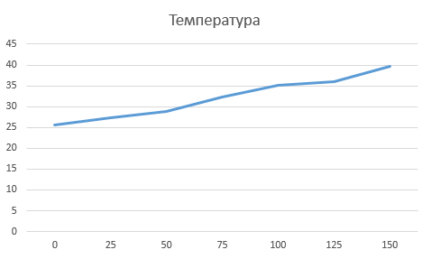
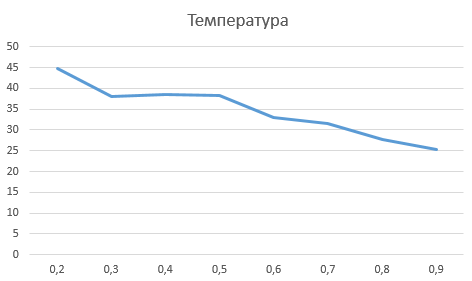
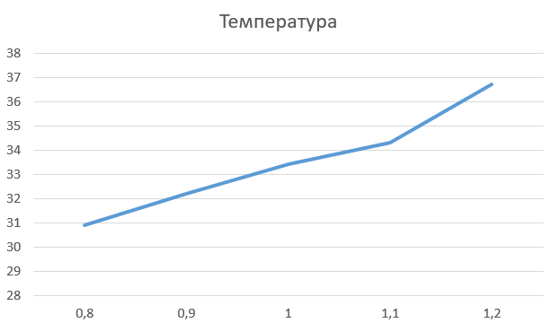
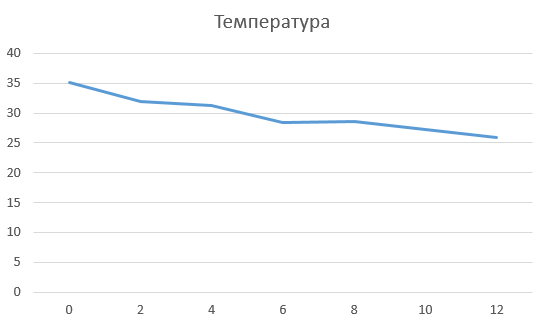

## Комп'ютерні системи імітаційного моделювання
## СПм-24-2, **Бакулін Артем Сергійович**
### Лабораторна робота №1. Опис імітаційних моделей та проведення обчислювальних експериментів

 

### Варіант 2, модель у середовищі NetLogo:
[Climate Change.](https://www.netlogoweb.org/launch#http://www.netlogoweb.org/assets/modelslib/Sample%20Models/Earth%20Science/Climate%20Change.nlogo) Дослідження парникового ефекту, зміни температури земної поверхні при різній концентрації CO2, наявності хмарності, снігу тощо.

 

### Вербальний опис моделі:
Модель відтворює потоки енергії в системі "Сонце - атмосфера - поверхня Землі". Сонячне випромінювання (жовті стрілки) частково відбивається хмарами й поверхнею (визначається альбедо), а решта поглинається поверхнею та перетворюється на теплову енергію (червоні крапки). Зі зростанням температури підвищується імовірність перетворення тепла на інфрачервоне випромінювання (пурпурові стрілки), яке проходить крізь хмари, але частково відбивається молекулами CO2 назад до поверхні. Температура поверхні пропорційна сумарній тепловій енергії в системі.

### Керуючі параметри:
- **SUN-BRIGHTNESS** - відносна інтенсивність сонячного потоку, `1,0` відповідає сучасному Сонцю.
- **ALBEDO** - частка відбитого сонячного світла поверхнею (0…1), орієнтовне значення для моделі - `0,6`.
- **CLOUDS** - додати/прибрати хмари (блокують сонячне, але не ІЧ-випромінювання).
- **CO2** - додавання/видалення молекул CO2 групами по 25 (до 150), CO2 блокує ІЧ і підсилює парниковий ефект.
- **WATCH A RAY** - спостереження за окремим променем.

### Внутрішні параметри:
- **sky-top** службова межа неба.
- **earth-top** рівень поверхні.
- **temperature** загальна температура поверхні (°C).
- **cloud-speed** швидкість руху агента‑хмари.
- **cloud-id** ідентифікатор кластера хмар.

### Показники роботи системи:
- поточна температура поверхні (°C).
- динаміка теплової енергії (червоні крапки).

### Примітки:
За відсутності хмар і CO2 та за яскравого Сонця температура швидко зростає і стабілізується поблизу сталого рівня - коли вхідний сонячний потік приблизно дорівнює вихідному ІЧ.

### Недоліки моделі:
Однозонне представлення планети (єдині температура й альбедо), відсутність просторової різниці у теплоємності (океан/суходол). Хмари впливають лише на видиме світло, CO2 - лише на ІЧ.

 

## Обчислювальні експерименти

### 1. Вплив концентрації CO2 на температуру
Досліджується залежність середньої температури за 10000 тактів після короткого розігріву від кількості молекул CO2.

Умови: **SUN-BRIGHTNESS = 1,0**, **ALBEDO = 0,6**, **хмари = відсутні**.  
Діапазон CO2: **0…150** з кроком **25**.

<table>
<thead>
<tr><th>Кількість молекул CO2</th><th>Температура, °C</th></tr>
</thead>
<tbody>
<tr><td>0</td><td>25,6</td></tr>
<tr><td>25</td><td>27,3</td></tr>
<tr><td>50</td><td>28,9</td></tr>
<tr><td>75</td><td>32,3</td></tr>
<tr><td>100</td><td>35,1</td></tr>
<tr><td>125</td><td>36,1</td></tr>
<tr><td>150</td><td>39,7</td></tr>
</tbody>
</table>

  
**Висновок:** збільшення CO2 підвищує температуру через повернення частини ІЧ-випромінювання до поверхні.

### 2. Вплив альбедо поверхні на температуру
Досліджується, як зміна **ALBEDO** впливає на температуру.

Умови: **SUN-BRIGHTNESS = 1,0**, **CO2 = 100**, **хмари = відсутні**.  
Діапазон **ALBEDO: 0,2…0,9** з кроком **0,1**.

<table>
<thead>
<tr><th>Альбедо</th><th>Температура, °C</th></tr>
</thead>
<tbody>
<tr><td>0,2</td><td>44,8</td></tr>
<tr><td>0,3</td><td>38,1</td></tr>
<tr><td>0,4</td><td>38,5</td></tr>
<tr><td>0,5</td><td>38,3</td></tr>
<tr><td>0,6</td><td>32,9</td></tr>
<tr><td>0,7</td><td>31,6</td></tr>
<tr><td>0,8</td><td>27,8</td></tr>
<tr><td>0,9</td><td>25,4</td></tr>
</tbody>
</table>

  
**Висновок:** чим вище альбедо, тим менше сонячної енергії поглинається й тим нижча температура.

### 3. Вплив інтенсивності Сонця на температуру
Перевіряється реакція моделі на зміну **SUN-BRIGHTNESS**.

Умови: **ALBEDO = 0,6**, **CO2 = 100**, **хмари = відсутні**.  
Діапазон **SUN-BRIGHTNESS: 0,8…1,2** з кроком **0,1**.

<table>
<thead>
<tr><th>Яркість Сонця</th><th>Середня температура, °C</th></tr>
</thead>
<tbody>
<tr><td>0,8</td><td>30,9</td></tr>
<tr><td>0,9</td><td>32,2</td></tr>
<tr><td>1,0</td><td>33,4</td></tr>
<tr><td>1,1</td><td>34,3</td></tr>
<tr><td>1,2</td><td>36,7</td></tr>
</tbody>
</table>

  
**Висновок:** підвищення інтенсивності Сонця приводить до зростання температури.

### 4. Вплив кількості хмар на температуру
Досліджується, як **кількість кластерів хмар** впливає на температуру за фіксованих інших параметрів.

Умови: **SUN-BRIGHTNESS = 1,0**, **ALBEDO = 0,6**, **CO2 = 100**.  
Кількість хмарних кластерів: **0…12** (крок 2).

<table>
<thead>
<tr><th>Кількість хмарних кластерів</th><th>Середня температура, °C</th></tr>
</thead>
<tbody>
<tr><td>0</td><td>35,2</td></tr>
<tr><td>2</td><td>32,0</td></tr>
<tr><td>4</td><td>31,2</td></tr>
<tr><td>6</td><td>28,5</td></tr>
<tr><td>8</td><td>28,6</td></tr>
<tr><td>10</td><td>27,3</td></tr>
<tr><td>12</td><td>25,9</td></tr>
</tbody>
</table>

  
**Висновок:** збільшення хмарності знижує поглинання сонячного випромінювання (хмари екранують видиме світло), тому температура зменшується.

