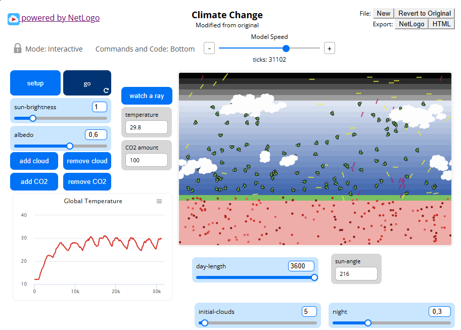
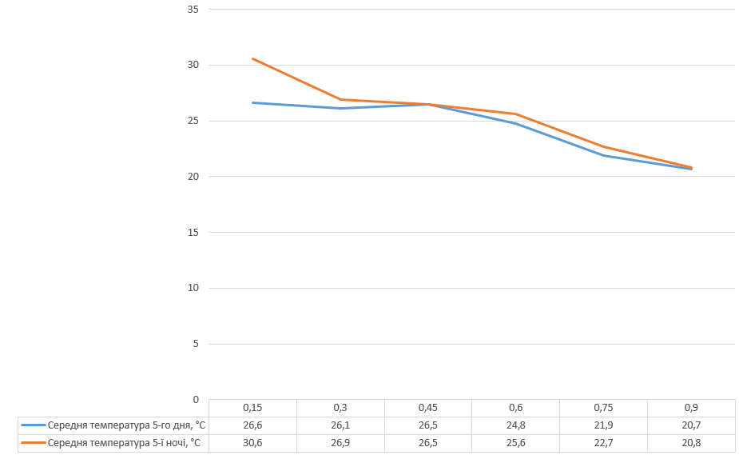

## Комп'ютерні системи імітаційного моделювання
## СПм-24-2, **Бакулін Артем Сергійович**
### Лабораторна робота №**2**. Редагування імітаційних моделей у середовищі NetLogo

 

### Варіант 2, модель у середовищі NetLogo:
[Climate Change](http://www.netlogoweb.org/launch#http://www.netlogoweb.org/assets/modelslib/Sample%20Models/Earth%20Science/Climate%20Change.nlogo) Дослідження парникового ефекту, зміни температури земної поверхні при різній концентрації CO2, наявності хмарності, снігу тощо.

 

### Внесені зміни у вихідну логіку моделі, за варіантом

**Початкова кількість хмар.**  
В інтерфейсі додано слайдер `initial-clouds`. У `setup` створюємо хмари:
<pre>
repeat initial-clouds [ add-cloud ]
</pre>

**Зміна кута падіння нових сонячних променів** (імітація добового руху Сонця).  
Додано слайдер `day-length` (тики/добу). Оновлення кута проходить раз за тик зі зміщенням так, щоб 180° відповідало полудню.
<pre>
to update-sun-angle
  let f ((ticks mod day-length) / day-length) 
  let day (1 - night)                           
  let start (night / 2)                           
  let finish (start + day)                        

  ifelse (f >= start) and (f < finish) [
    let t ((f - start) / day)                    
    set sun-angle 90 + 180 * t                   
  ] [
    set sun-angle 180                             
  ]
end
</pre>

### Особисте завдання: **довжина ночі**

Додано слайдер `night` у межах від 0.0 до 1 (частка доби, яка припадає на ніч).  
День займає частку `day = 1 - night` і розташований по центру добового кола (ніч по краях).

Фінальний код моделі та її інтерфейс доступні за [посиланням](model.nlogox).
 

## Обчислювальні експерименти

### 1. Вплив **довжини ночі** на середню температуру
Досліджується як довжина ночі відносно всього дня впливає на середню температуру. 

**Умови:** `SUN-BRIGHTNESS = 1.0`, `ALBEDO = 0.6`, `CO2 = 100`, `initial-clouds = 5`, `day-length = 3600`.  
Довжина ночі `night`: 0.15…0.9 (крок 0.15).  
Запуск моделі до **5-го дня (16000 та 18000 тіки)**, фіксація середньої температури вдень та вночі.

<table>
<thead>
<tr><th>Довжина ночі (частка доби)</th><th>Середня температура 5-го дня, °C</th><th>Середня температура 5-ї ночі, °C</th></tr>
</thead>
<tbody>
<tr><td>0,15</td><td>26,6</td><td>30,6</td></tr>
<tr><td>0,30</td><td>26,1</td><td>26,9</td></tr>
<tr><td>0,45</td><td>26,5</td><td>26,5</td></tr>
<tr><td>0,60</td><td>24,8</td><td>25,6</td></tr>
<tr><td>0,75</td><td>21,9</td><td>22,7</td></tr>
<tr><td>0,90</td><td>20,7</td><td>20,8</td></tr>
</tbody>
</table>

  
**Висновок:** зі збільшенням ночної частини падає середня за добу температура.
