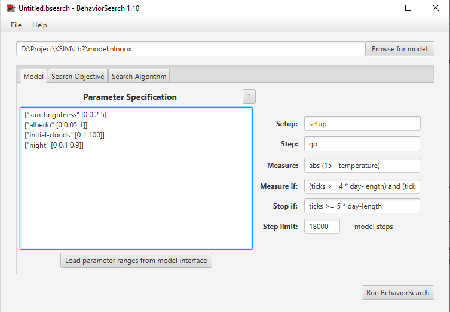
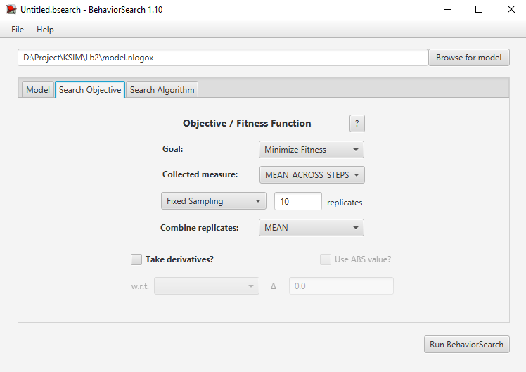
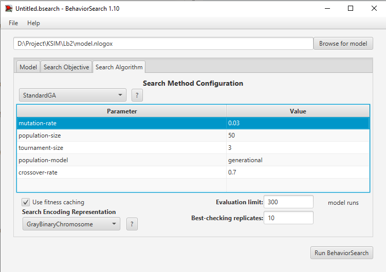
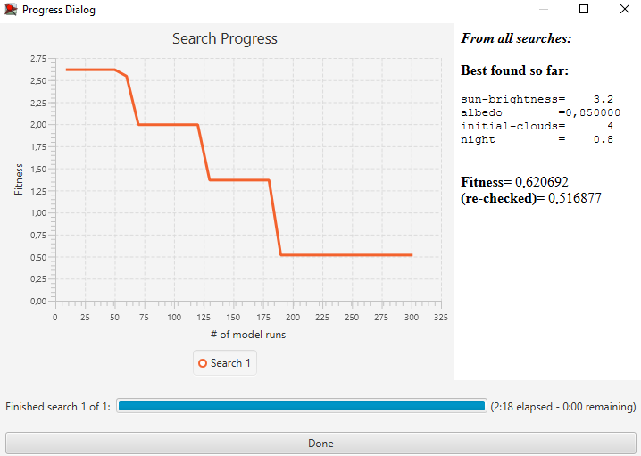

## Комп'ютерні системи імітаційного моделювання
## СПм-24-2, **Бакулін Артем Сергійович**
### Лабораторна робота №**3**. Використання засобів обчислювального интелекту для оптимізації імітаційних моделей

 

### Варіант 2, модель у середовищі NetLogo:
[Climate Change](http://www.netlogoweb.org/launch#http://www.netlogoweb.org/assets/modelslib/Sample%20Models/Earth%20Science/Climate%20Change.nlogo)

 

#### Вербальний опис моделі:
У моделі імітується енергетичний баланс Землі з урахуванням сонячного випромінювання, парникових газів (CO₂), альбедо поверхні, хмарності та снігового покриву. У використаній версії додано: початкову кількість хмар, добовий рух Сонця та параметр довжини ночі `night` (день у центрі добового циклу, ніч по краях).

#### Керуючі параметри:
- **sun-brightness** - інтенсивність сонячного випромінювання.
- **albedo** - частка відбитого випромінювання.
- **day-length** - тривалість доби у кроках моделі.
- **initial-clouds** - початкова кількість кластерів хмар.
- **night** - частка доби, що припадає на ніч.

#### Показники роботи моделі:
- середня температура поверхні.

 

### Налаштування середовища BehaviorSearch:

**Обрана модель**:
<pre>
model.nlogox
</pre>

**Параметри моделі** (вкладка Model):  
<pre>
["sun-brightness" [0 0.2 5]]
["albedo"         [0 0.05 1]]
["initial-clouds" [0 1 100]]
["night"          [0 0.1 0.9]]
</pre>
Використовувана **міра**:  
Для фітнес-функції (вона ж функція пристосованості або цільова функція) обрано мінімізацію відхилення денної середньої температури 5-ї доби від цільового значення 15 °C.
У параметрі "**Measure**":
<pre>
abs (15 - temperature)
</pre>
Середня температура повинна враховуватися лише для денних кроків 5-ї доби:  
у полі "**Measure if**":
<pre>
(ticks >= 4 * day-length) and (ticks < 5 * day-length) and (is-not-night = 1)
</pre>
Параметри "**Setup**" та "**Go**" - стандартні процедури моделі.  
"**Stop if**" - `ticks >= 5 * day-length.`  
"**Step limit**" - `18000` (5 × 3600) для гарантії 5-ї доби при будь-якому `day-length`.  
Загальний вигляд вкладки налаштувань параметрів моделі:  

**Налаштування цільової функції** (вкладка Search Objective):  
Метою є **мінімізація** середньої абсолютної похибки відносно цілі 15 °C на 5-ту добу - параметр 
"**Goal**" = **Minimize Fitness**; 
"**Collected measure**" = **MEAN_ACROSS_STEPS**. 
Щоб зменшити вплив випадковості, кожна симуляція повторюється по 10 разів, результуюче значення - **MEAN**.  
Загальний вигляд вкладки налаштувань цільової функції:  

**Налаштування алгоритму пошуку** (вкладка Search Algorithm):  
Використано два алгоритми: **RandomSearch** і **StandardGA**.  
Для обох: **Use fitness caching** - увімкнено, **Evaluation limit** - 300.  
**StandardGA**: `population-size=50`, `crossover-rate=0.7`, `mutation-rate=0.03`, `tournament-size=3`, `population-model=generational`.  
Загальний вид вкладки налаштувань пошуку:  

 

### Результати використання BehaviorSearch:
Результат пошуку параметрів імітаційної моделі, використовуючи **генетичний алгоритм**:  
  
Результат пошуку параметрів імітаційної моделі, використовуючи **випадковий пошук**:  

